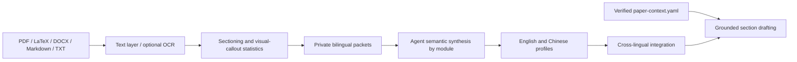

<div align="center">

# Paper Alchemist

### Distill how great papers write. Draft with evidence, not invention.

A model-agnostic Agent Skill for modular, bilingual academic-writing distillation and grounded paper drafting.

[](https://github.com/Wang-Ruibin/paper-alchemist/actions/workflows/ci.yml)
[](https://github.com/Wang-Ruibin/paper-alchemist/releases)
[](https://www.python.org/)
[](https://agentskills.io/)
[](LICENSE)

**English** · [简体中文](README.zh-CN.md)

</div>

## Why Paper Alchemist?

Academic corpora can teach an Agent **how to write**: how an abstract moves from problem to evidence, how an introduction places its gap, or how a results section separates observation from interpretation. They must never be treated as evidence for **what is true** about your research.

Paper Alchemist keeps those responsibilities separate:

- local Python extracts, sections, hashes, measures, and validates papers;
- the active Agent distills corpus-level writing patterns and drafts prose;
- `paper-context.yaml` and explicit user answers are the only factual sources;
- no bundled script calls an LLM API;
- no single author is imitated and no long source passage is retained in a profile.

## Highlights

- **Modular distillation** — separate profiles for abstract, introduction, related work, problem definition, methodology, experiment setup, results analysis, and conclusion.
- **Bilingual by design** — preserve English and Chinese evidence separately, then blend both during generation; the target writing language leads at roughly 70/30.
- **Grounded generation** — block drafting until semantic profiles are complete, report missing research facts, and allow only declared citation keys.
- **Incremental and resumable** — reuse hash-matched extraction caches and invalidate only profiles affected by corpus changes.
- **Figure/table-aware PDFs** — retain text-bearing visual papers, count figure/table callouts, and optionally OCR low-text or scanned pages.
- **Cross-Agent** — one open Agent Skill with adapters for Codex, Claude Code, OpenCode, Hermes, Pi Agent, and Kimi Code.
- **Private by default** — source papers, extracted text, research context, and generated profiles remain outside version control.

## 60-second start

Python 3.11 or newer is required. `pdftotext` is recommended for PDFs; `pypdf` is the text-layer fallback. Optional OCR requires both `pdftoppm` and `tesseract` on `PATH` (install Chinese language data to OCR Chinese pages).

```bash
git clone https://github.com/Wang-Ruibin/paper-alchemist.git
cd paper-alchemist
python -m venv .venv
. .venv/bin/activate
python -m pip install -e .
```

Install for your Agent:

```bash
paper-alchemist install --agent codex --scope user
# agents: codex | claude | opencode | hermes | pi | kimi
# scopes: user | project
```

Distill a paper folder:

```bash
paper-alchemist distill ./papers --profile routing-literature --language auto --ocr auto
```

Ask the installed Skill to finish semantic distillation, then integrate:

```bash
paper-alchemist integrate --profile routing-literature
paper-alchemist validate-profile --profile routing-literature
```

Draft an abstract through the Agent:

```text
/abstract profile=routing-literature lang=en format=latex context=paper-context.yaml
```

## How it works



1. `distill` discovers papers, extracts text layers or optional OCR, removes references and appendices, detects language, segments modules, and creates private evidence packets.
2. The active Agent reviews packets and replaces quantitative seeds with aggregate semantic findings.
3. `integrate` refuses incomplete or stale module profiles, then builds English, Chinese, cross-lingual, and conflict profiles.
4. A section command builds a generation brief, checks required facts and citations, and drafts in the requested language and format.

## Commands

| Command | Purpose |
|---|---|
| `distill SOURCE --profile NAME --language auto\|en\|zh --ocr auto\|never\|always` | Extract and partition a corpus, with optional PDF OCR |
| `integrate --profile NAME` | Integrate completed semantic profiles |
| `validate-profile --profile NAME` | Report structural, semantic, confidence, and integration status |
| `brief MODULE --profile NAME --language en\|zh` | Build a grounded bilingual drafting brief |
| `install --agent AGENT --scope user\|project` | Install the core Skill and native wrappers |
| `package-skill --output dist` | Build `paper-alchemist.skill` |
| `validate-skill [PATH]` | Validate the portable Agent Skill bundle |

Section operations:

`abstract` · `introduction` · `related-work` · `problem-definition` · `methodology` · `experiment-setup` · `results-analysis` · `conclusion` · `section`

## Agent support

| Agent | Installed entry point |
|---|---|
| Codex | `$paper-alchemist abstract ...` |
| Claude Code | `/abstract ...` |
| OpenCode | `/abstract ...` |
| Hermes | `/abstract ...` |
| Pi Agent | `/abstract ...` |
| Kimi Code | `/skill:abstract ...` |

See [platform details](paper-alchemist/references/platforms.md) for user/project paths and native behavior.

## Evidence and language contract

Generation applies this priority:

1. target-language module profile;
2. secondary-language module profile;
3. target-language integrated profile;
4. cross-lingual structure profile;
5. factual and academic-writing constraints.

The secondary language contributes rhetorical function and information organization—not translated surface syntax. If either language has no valid evidence, generation continues with an explicit low-confidence, single-language fallback.

Paper Alchemist never invents contributions, methods, datasets, baselines, parameters, results, significance, limitations, or citations. LaTeX uses `\cite{key}`; Markdown uses only the citation convention and keys declared in the context.

For figure/table-heavy PDFs, the corpus may teach how authors introduce, compare, and interpret visual evidence. Numeric values remain research facts: the Agent may use them in generated prose only when they are also present in `paper-context.yaml` or explicitly confirmed by the user. OCR recovers text; it does not infer chart geometry or unlabelled values.

## Repository layout

```text
engine/                      deterministic Python engine source
paper-alchemist/             portable Agent Skill
adapters/                    cross-Agent installation manifest
.github/workflows/           minimal build and compatibility checks
```

The public repository contains only the installable project. Tests, synthetic fixtures, grounded examples, source papers, extracted text, generated profiles, research contexts, and temporary artifacts stay local and are ignored by Git.

## Validation

GitHub Actions checks Python 3.11–3.13 builds, portable Skill structure, packaging, CLI startup, and dry-run installation for all six supported Agents. The full behavioral test suite and research-corpus validation remain local to prevent fixtures, generated profiles, or copyrighted inputs from entering the public project.

## Development

```bash
python -m pip install -e '.[dev]'
ruff check engine
paper-alchemist validate-skill
python -m build
paper-alchemist package-skill --output dist
```

## License

MIT © 2026 [misakimei0331](https://github.com/misakimei0331). See [LICENSE](LICENSE).
