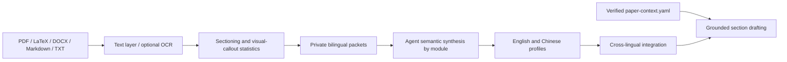

<div align="center">

# Paper Alchemist

### Distill how great papers write. Draft with evidence, not invention.

A model-agnostic Agent Skill for modular, bilingual academic-writing distillation and grounded paper drafting.

[](https://github.com/Wang-Ruibin/paper-alchemist/actions/workflows/ci.yml)
[](https://github.com/Wang-Ruibin/paper-alchemist/releases)
[](https://www.python.org/)
[](https://agentskills.io/)
[](LICENSE)

**English** · [简体中文](README.zh-CN.md)

</div>

## Why Paper Alchemist?

Academic corpora can teach an Agent **how to write**: how an abstract moves from problem to evidence, how an introduction places its gap, or how a results section separates observation from interpretation. They must never be treated as evidence for **what is true** about your research.

Paper Alchemist keeps those responsibilities separate:

- local Python extracts, sections, hashes, measures, and validates papers;
- the active Agent distills corpus-level writing patterns and drafts prose;
- `paper-context.yaml` and explicit user answers are the only factual sources;
- no bundled script calls an LLM API;
- no single author is imitated and no long source passage is retained in a profile.

## Highlights

- **Modular distillation** — separate profiles for abstract, introduction, related work, problem definition, methodology, experiment setup, results analysis, and conclusion.
- **Bilingual by design** — preserve English and Chinese evidence separately, then blend both during generation; the target writing language leads at roughly 70/30.
- **Grounded generation** — block drafting until semantic profiles are complete, report missing research facts, and allow only declared citation keys.
- **Incremental and resumable** — reuse hash-matched extraction caches and invalidate only profiles affected by corpus changes.
- **Figure/table-aware PDFs** — retain text-bearing visual papers, count figure/table callouts, and optionally OCR low-text or scanned pages.
- **Cross-Agent** — one open Agent Skill with adapters for Codex, Claude Code, OpenCode, Hermes, Pi Agent, and Kimi Code.
- **Private by default** — source papers, extracted text, research context, and generated profiles remain outside version control.

## 60-second start: install → distill → generate

The entire workflow happens through a terminal-and-file-capable Agent. **A paper profile answers “how papers like these write,” not “what is true about your research.”** New content must take its research facts from `paper-context.yaml` or your explicit answers.

### 1. First use: ask the Agent to install it

Send this to Codex, Claude Code, OpenCode, Hermes, Pi Agent, or Kimi Code:

```text
Install Paper Alchemist from https://github.com/Wang-Ruibin/paper-alchemist and
configure it at user scope for the Agent you are currently running as. Check for
Python 3.11+, choose this platform's adapter, create an isolated Python environment
that remains callable from future sessions, and verify both the CLI and Skill.
Do not overwrite an existing installation. Ask before installing or upgrading Python,
PDF tools, or OCR components. Tell me whether I must start a new session when done.
```

Replace “user scope” with “project scope” to enable it only in the current research project. If the Agent says Skill discovery requires a reload, start a new session.

### 2. Start distilling: provide a paper folder and profile name

Put the reference papers in a folder such as `./papers/`, then tell the Agent from your research project:

```text
Use Paper Alchemist to distill ./papers into a profile named routing-literature.
Before processing, check the research project's .gitignore and keep the papers,
paper-context.yaml, and .paper-alchemist/ out of version control. Detect English,
Chinese, and OCR needs automatically. Complete paper extraction, per-paper observations,
module-level semantic synthesis, bilingual integration, and final checks. Keep working
until the profile can actually be used for writing; do not stop after extraction.
If you cannot resolve something yourself, tell me only what I need to do. When finished,
explain in plain language whether the profile is ready, which papers were included,
and any limitations.
```

The Agent stores a reusable profile in the current research project. Source papers, research context, extracted text, and profiles may contain private material and should be excluded by that project's `.gitignore`.

### 3. Wait for the Agent to say “the profile is ready”

You do not need to inspect intermediate files or understand validation fields. When finished, the Agent should give you a conclusion like this:

> **The `routing-literature` profile is ready for writing.** Eighteen papers were included and two were excluded because their text could not be extracted. The English results-analysis profile has limited evidence and will be marked low confidence when used.

If the Agent says only that papers were extracted, an initial profile was created, modules remain, or integration still needs to run, distillation is not finished. Reply with:

```text
Continue the remaining distillation, integration, and checks. Tell me when the profile
is genuinely ready for writing. If you cannot continue, explain why and what I need to do.
```

The Agent performs the technical validation internally and translates small-corpus, single-language, OCR, and excluded-paper limitations into plain language. Technical status fields remain in the [command table](#commands) for troubleshooting only.

### 4. Let the Agent build your research context and generate new content

You do not need to write `paper-context.yaml` yourself. It is the Agent's structured record of which facts about your research have been confirmed:

`paper profile (how to write) + research context (what to say) = new content`

If you already have a draft, experiment notes, result tables, or a BibTeX file, give their paths to the Agent:

```text
I want to use the routing-literature profile to write an English abstract. First read:
- ./draft/method.md
- ./results/summary.xlsx
- ./references.bib

Extract only research facts that are explicitly present in those materials. Do not treat
the reference-paper profile as evidence about my research. In small groups, ask me about
anything required by the abstract that is missing or ambiguous. First summarize the
problem, gap, method, contributions, results, and citations you plan to record. After I
confirm them, create ./paper-context.yaml and check that it contains everything the
abstract requires.
```

If your materials are not organized yet, build the context entirely through conversation:

```text
I want to use the routing-literature profile to write an English abstract, but I do not
have paper-context.yaml. Help me build the research context through conversation. Ask one
small group of easy-to-answer questions at a time, covering my research problem, the gap
in existing work, my method, main contributions, key experimental results, and allowed
citations. Never guess a fact or number. When the information is complete, show me a short
fact checklist. After I confirm it, create ./paper-context.yaml and check whether it is
sufficient for the abstract.
```

The Agent collects only facts required by the section you are writing. A methodology section mainly needs the method's name, purpose, and components; results analysis also needs metrics, comparison targets, exact values, and confirmed interpretations. Missing information may remain empty, but the Agent will not invent it.

After confirming the research context, tell the Agent:

```text
Use the ready routing-literature profile and ./paper-context.yaml to draft a new English
LaTeX abstract. If any required facts are still missing, continue asking me. Do not add
unconfirmed results or citations. When finished, explain any known profile limitations
and return the draft in chat.
```

Replace “abstract” with introduction, related work, problem definition, methodology, experiment setup, results analysis, conclusion, or a custom section. You may also provide an exact output path.

## How it works



1. `distill` discovers papers, extracts text layers or optional OCR, removes references and appendices, detects language, segments modules, and creates private evidence packets.
2. The active Agent reviews packets and replaces quantitative seeds with aggregate semantic findings.
3. `integrate` refuses incomplete or stale module profiles, then builds English, Chinese, cross-lingual, and conflict profiles.
4. A section command builds a generation brief, checks required facts and citations, and drafts in the requested language and format.

## Commands

| Command | Purpose |
|---|---|
| `distill SOURCE --profile NAME --language auto\|en\|zh --ocr auto\|never\|always` | Extract and partition a corpus, with optional PDF OCR |
| `integrate --profile NAME` | Integrate completed semantic profiles |
| `validate-profile --profile NAME` | Report structure, semantic and integration status, and the `generation_ready` completion signal |
| `brief MODULE --profile NAME --language en\|zh` | Build a grounded bilingual drafting brief |
| `install --agent AGENT --scope user\|project` | Install the core Skill and native wrappers |
| `package-skill --output dist` | Build `paper-alchemist.skill` |
| `validate-skill [PATH]` | Validate the portable Agent Skill bundle |

Section operations:

`abstract` · `introduction` · `related-work` · `problem-definition` · `methodology` · `experiment-setup` · `results-analysis` · `conclusion` · `section`

## Agent support

| Agent | Installed entry point |
|---|---|
| Codex | `$paper-alchemist abstract ...` |
| Claude Code | `/abstract ...` |
| OpenCode | `/abstract ...` |
| Hermes | `/abstract ...` |
| Pi Agent | `/abstract ...` |
| Kimi Code | `/skill:abstract ...` |

See [platform details](paper-alchemist/references/platforms.md) for user/project paths and native behavior.

## Evidence and language contract

Generation applies this priority:

1. target-language module profile;
2. secondary-language module profile;
3. target-language integrated profile;
4. cross-lingual structure profile;
5. factual and academic-writing constraints.

The secondary language contributes rhetorical function and information organization—not translated surface syntax. If either language has no valid evidence, generation continues with an explicit low-confidence, single-language fallback.

Paper Alchemist never invents contributions, methods, datasets, baselines, parameters, results, significance, limitations, or citations. LaTeX uses `\cite{key}`; Markdown uses only the citation convention and keys declared in the context.

For figure/table-heavy PDFs, the corpus may teach how authors introduce, compare, and interpret visual evidence. Numeric values remain research facts: the Agent may use them in generated prose only when they are also present in `paper-context.yaml` or explicitly confirmed by the user. OCR recovers text; it does not infer chart geometry or unlabelled values.

## Repository layout

```text
engine/                      deterministic Python engine source
paper-alchemist/             portable Agent Skill
adapters/                    cross-Agent installation manifest
.github/workflows/           minimal build and compatibility checks
```

The public repository contains only the installable project. Tests, synthetic fixtures, grounded examples, source papers, extracted text, generated profiles, research contexts, and temporary artifacts stay local and are ignored by Git.

## Validation

GitHub Actions checks Python 3.11–3.13 builds, portable Skill structure, packaging, CLI startup, and dry-run installation for all six supported Agents. The full behavioral test suite and research-corpus validation remain local to prevent fixtures, generated profiles, or copyrighted inputs from entering the public project.

## Development

```bash
python -m pip install -e '.[dev]'
ruff check engine
paper-alchemist validate-skill
python -m build
paper-alchemist package-skill --output dist
```

## License

MIT © 2026 [misakimei0331](https://github.com/misakimei0331). See [LICENSE](LICENSE).

If Paper Alchemist helps your research writing, a Star would make this little alchemist smile. ✨
