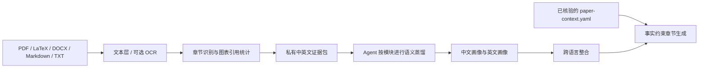

<div align="center">

# Paper Alchemist

### 蒸馏优秀论文的写法，用可信证据完成写作。

一个与模型无关、支持模块化双语文风蒸馏和事实约束写作的 Agent Skill。

[](https://github.com/Wang-Ruibin/paper-alchemist/actions/workflows/ci.yml)
[](https://github.com/Wang-Ruibin/paper-alchemist/releases)
[](https://www.python.org/)
[](https://agentskills.io/)
[](LICENSE)

[English](README.md) · **简体中文**

</div>

## 为什么需要 Paper Alchemist？

论文语料可以告诉 Agent **应该怎样写**：摘要如何从问题推进到证据，引言如何放置研究缺口，结果分析如何区分观察与解释。但论文语料不能替你的研究回答 **什么是真的**。

Paper Alchemist 将这两类职责严格分离：

- 本地 Python 负责抽取、分段、哈希、统计和校验；
- 当前 Agent 负责跨论文语义蒸馏和正文写作；
- `paper-context.yaml` 与使用者明确回答的信息是研究事实的唯一来源；
- 内置脚本不调用任何 LLM API；
- 不模仿单一作者，也不在画像中保存论文长句。

## 核心能力

- **模块化蒸馏**：分别处理摘要、引言、相关工作、问题定义、方法、实验设置、结果分析和结论。
- **原生双语设计**：蒸馏阶段分别保存中英文证据；生成阶段同时借鉴两种语言，目标语言约占 70%。
- **事实约束生成**：语义画像未完成时禁止写作；检查当前章节缺失的研究事实，并只允许使用声明过的 citation key。
- **增量与续跑**：复用哈希一致的抽取缓存，只将受到语料变化影响的模块画像标记为过期。
- **支持图表型 PDF**：保留具有文本层的图表密集论文，统计图表引用，并可对低文本或扫描页执行 OCR。
- **跨 Agent 使用**：同一开放 Skill 支持 Codex、Claude Code、OpenCode、Hermes、Pi Agent 和 Kimi Code。
- **默认保护隐私**：论文原文、抽取全文、研究上下文和生成画像默认不进入版本控制。

## 60 秒上手：安装 → 蒸馏 → 生成

全程只需和能够访问终端及文件的 Agent 对话。**论文画像回答“这类论文怎样写”，不提供“你的研究有什么事实”**；生成新内容时，研究事实必须来自 `paper-context.yaml` 或你的明确回答。

### 1. 第一次使用：让 Agent 安装

把这段话发给 Codex、Claude Code、OpenCode、Hermes、Pi Agent 或 Kimi Code：

```text
请从 https://github.com/Wang-Ruibin/paper-alchemist 安装 Paper Alchemist，
并为当前 Agent 做用户级配置。请自动检查 Python 3.11+、选择当前平台适配器、
建立以后新会话仍可调用的隔离 Python 环境，并验证 CLI 与 Skill 均安装成功。
不要覆盖已有安装；安装或升级 Python、PDF 工具或 OCR 组件前先征得我的同意。
完成后告诉我是否需要重新打开会话。
```

只想在当前研究项目中启用时，把“用户级配置”改成“项目级配置”。如果 Agent 提示需要重新加载 Skill，请开启一个新会话。

### 2. 开始蒸馏：给出论文目录和画像名

先把参考论文放进一个目录，例如研究项目下的 `./papers/`。然后在该研究项目中告诉 Agent：

```text
请使用 Paper Alchemist 蒸馏 ./papers，画像名为 routing-literature。
开始前检查研究项目的 .gitignore，确保论文、paper-context.yaml 和
.paper-alchemist/ 不会进入版本控制。自动识别中英文与 OCR 需求，
完成论文抽取、逐篇观察、逐模块语义蒸馏、
双语整合和最终校验。不要在只生成抽取结果或 seed 文件时停下；请持续处理，
直到 validate-profile 返回 generation_ready: true，或遇到必须由我处理的阻塞。
最后报告画像目录、纳入与排除的论文、警告、未完成模块和 generation_ready。
```

Agent 会在当前研究项目的 `.paper-alchemist/profiles/routing-literature/` 保存可复用画像。论文原文、研究上下文、抽取文本和画像都可能包含私有内容，应由该研究项目的 `.gitignore` 排除。

### 3. 判断蒸馏是否完成：只认 `generation_ready`

Agent 的最终报告中必须出现：

```text
generation_ready: true
```

这表示画像结构有效、所有中英文模块的语义蒸馏都已完成，并且双语整合文件齐全。**只有 `valid: true` 不代表蒸馏完成**：它可能只说明文件结构正确。

如果 `generation_ready: false`，查看 Agent 报告的 `incomplete_profiles` 和 `errors`，让它继续：

```text
请继续完成 incomplete_profiles 中列出的模块，修复 errors，重新整合并校验，
直到 generation_ready: true；不要把 pending、stale 或仅有 seed 的画像称为完成。
```

`warnings` 可能只是语料较少或单语证据不足，不一定阻止生成，但 Agent 必须说明这些限制。

### 4. 使用画像生成新内容

准备 `paper-context.yaml`，写入你的研究问题、方法、实验、结果和可用 citation key。若还没有该文件，可以先说：“请根据 Paper Alchemist 的 `paper-context.example.yaml` 引导我建立研究上下文。”

画像准备完成后，直接描述要写的内容：

```text
请先确认 routing-literature 的 generation_ready 为 true，然后使用这个画像和
./paper-context.yaml 生成一篇新的中文 LaTeX 摘要。研究事实和引用只能来自
paper-context.yaml 或我的明确回答；如果必要事实不足，只询问摘要缺少的信息。
完成后说明使用了哪些语言画像、是否发生降级，并把正文返回到聊天中。
```

把“摘要”替换成引言、相关工作、问题定义、方法、实验设置、结果分析、结论或自定义章节即可；也可以明确给出输出文件路径。底层[命令表](#命令)仅供自动化和排障使用。

## 工作原理



1. `distill` 发现文件、抽取文本层或执行可选 OCR、排除参考文献和附录、检测语言、识别论文结构并生成私有证据包。
2. 当前 Agent 阅读证据包，将定量 seed profile 替换为跨论文语义规律。
3. `integrate` 拒绝未完成或已过期的模块画像，再生成中文、英文、跨语言和冲突画像。
4. 章节命令生成写作 brief，检查必要事实与引用，然后以指定语言和格式写作。

## 命令

| 命令 | 用途 |
|---|---|
| `distill SOURCE --profile NAME --language auto\|en\|zh --ocr auto\|never\|always` | 抽取并划分论文语料，可选 PDF OCR |
| `integrate --profile NAME` | 整合已经完成的语义画像 |
| `validate-profile --profile NAME` | 报告结构、语义、整合状态及 `generation_ready` 完成信号 |
| `brief MODULE --profile NAME --language en\|zh` | 生成受事实约束的双语写作 brief |
| `install --agent AGENT --scope user\|project` | 安装核心 Skill 与平台命令包装器 |
| `package-skill --output dist` | 构建 `paper-alchemist.skill` |
| `validate-skill [PATH]` | 校验可移植 Agent Skill 包 |

章节操作包括：

`abstract` · `introduction` · `related-work` · `problem-definition` · `methodology` · `experiment-setup` · `results-analysis` · `conclusion` · `section`

## Agent 支持

| Agent | 安装后的入口 |
|---|---|
| Codex | `$paper-alchemist abstract ...` |
| Claude Code | `/abstract ...` |
| OpenCode | `/abstract ...` |
| Hermes | `/abstract ...` |
| Pi Agent | `/abstract ...` |
| Kimi Code | `/skill:abstract ...` |

用户级、项目级目录和各平台原生行为见[平台说明](paper-alchemist/references/platforms.md)。

## 双语与事实边界

生成时按以下顺序使用画像：

1. 目标语言当前模块画像；
2. 另一语言当前模块画像；
3. 目标语言综合画像；
4. 跨语言结构画像；
5. 事实约束与学术写作底线。

另一语言只贡献修辞功能和信息组织，不迁移表层句式。如果某一种语言没有有效证据，系统会使用已有画像继续生成，并明确标记低置信度单语降级。

Paper Alchemist 不会编造贡献、方法、数据集、基线、参数、结果、显著性、局限或引用。LaTeX 使用 `\cite{key}`；Markdown 只使用上下文中声明的引用格式与 citation key。

对于图表型 PDF，语料可以用于提炼作者如何引入、比较和解释图表证据，但数值仍属于研究事实：只有当数值同时出现在 `paper-context.yaml` 中，或由使用者明确确认时，Agent 才能将其写入正文。OCR 只恢复文字，不推断曲线几何关系或未标注数值。

## 仓库结构

```text
engine/                      确定性 Python 引擎源码
paper-alchemist/             可移植 Agent Skill
adapters/                    跨 Agent 安装清单
.github/workflows/           最小构建与兼容性检查
```

公开仓库只包含可安装的项目主体。测试、原创 fixtures、事实约束样例、论文原文、抽取文本、生成画像、研究上下文和临时产物全部保留在本地，并由 Git 忽略。

## 验证情况

GitHub Actions 会在 Python 3.11–3.13 上检查构建、可移植 Skill 结构、打包、CLI 启动和六种 Agent 的安装器 dry-run。完整行为测试与真实论文语料验证仅在本地运行，避免 fixtures、生成画像或受版权保护的输入进入公开项目。

## 开发

```bash
python -m pip install -e '.[dev]'
ruff check engine
paper-alchemist validate-skill
python -m build
paper-alchemist package-skill --output dist
```

## 开源协议

MIT © 2026 [misakimei0331](https://github.com/misakimei0331)。详见 [LICENSE](LICENSE)。

如果 Paper Alchemist 对你的研究写作有帮助，欢迎随手送它一颗 Star，让这位小炼金术士开心一下。✨
